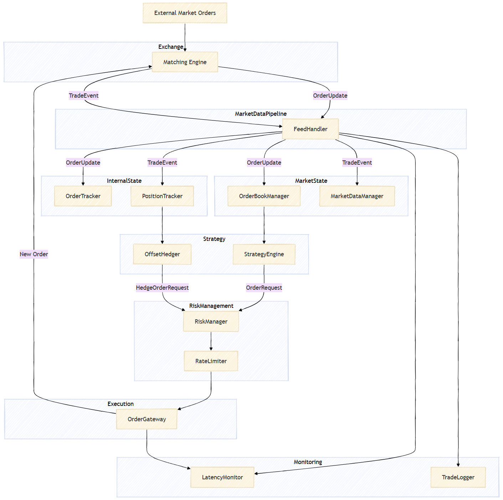

# C++ Trading Systems
Contains simplified C++ implementations of core components commonly found in electronic trading systems.

## Exchange

### [Matching Engine](./exchange/MatchingEngine/README.md)
Matches orders based on price-time priority, executes trades when bid >= ask

## Trading System

### Data Pipeline

### [Market Feed Handler](./trading-system/MarketFeedHandler/README.md)
Parses raw feed messages, converts them into internal normalized structures

### Market State

### [Order Book Manager](./trading-system/OrderBookManager/README.md)
Maintains the current bid/ask order book for each symbol, reconstructs exchange book from incremental updates

### [Market Data Manager](./trading-system/MarketDataManager/README.md)
Aggregates market statistics such as: VWAP, Last Traded Price, Volume, Rolling Averages

### Internal State

### [Order Tracker](./trading-system/OrderTracker/README.md)
Maintains lifecycle state of each order

### [Position](./trading-system/PositionTracker/README.md)
Maintains position per symbol, calculates realized and unrealized PnL

### Strategy

### [Strategy Engine](./trading-system/StrategyEngine/README.md)
Generates trading signals based on market conditions

### [Offset Hedger](./trading-system/OffsetHedger/README.md) - _UPDATE_
Generates hedge trades to offset risk exposure

### Risk Management

### [Risk Manager](./trading-system/RiskManager/README.md) - _TODO_
Validates risk limits before allowing order submission, checks: Max Position, Max Order Size, Daily Loss Limits

### [Rate Limiter](./trading-system/RateLimiter/README.md) - _TODO_
Prevents sending too many orders to the exchange, ensures compliance with exchange rate limits

### Execution

### [Order Gateway](./trading-system/OrderGateway/README.md) - _TODO_
Handles communication with exchange APIs, sends orders and receives execution reports

### Monitoring

### [Trade Logger](./monitoring/TradeLogger/README.md) - _TODO_
Persists system events (orders, trades, and market data) for audit, replay, and debugging

### [Latency Monitor](./monitoring/LatencyMonitor/README.md) - _TODO_
Measures latency between key system stages such as: Market data receive → strategy decision, Strategy decision → order submission, Order submission → exchange acknowledgment
